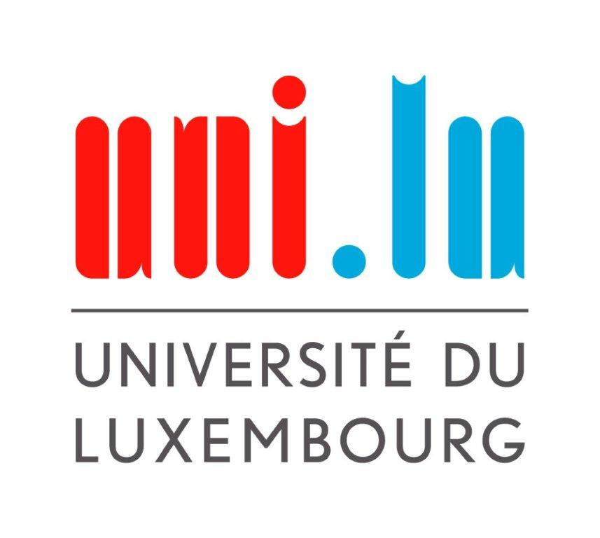

	
	
 26/04/2022

	

# 
Group 4 – Meeting Report 8
## General Information

### Location
Onsite - LLC
### Time 
11:30 - 13:00
### Attendees
 - Patrick Silva
 - Tiago Goncalves Da Silva
 - Matteo Vitellaro
 - Daniel Sousa

 
## Meeting Content
In this meeting we finished the presentation for the next course. We went through the different points that were asked and we decided on what we should do for the second sprint.
The first week will be used to finish the game progression (finishing floors, adding rooms) and adding health bar and currency for the player.
The second week will be used to balance out the game meaning make the game more enjoyable and maybe harder.
The third week we will have people test the game and give us reviews.
The forth week will be used to finish up the game by fixing some bugs and polish the game.
