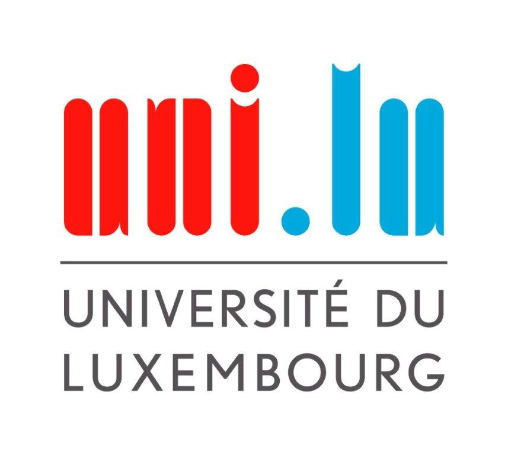

	
	
 02/03/2022

	

# 
Group 4 – Meeting Report 1
## General Information

### Location
Belval Campus, Luxembourg Learning Centre
### Time 
10:20 - 11:20
### Attendees
 - Patrick Silva
 - Daniel Sousa
 - Tiago Goncalves Da Silva
 - Matteo Vitellaro

### Absentees
 - /
 
## Meeting Content

### Previous Meeting Review
/
###  Agenda

1. #### Project topic discussion
Patrick presented in PowerPoint format his ideas for a possible Quiz app, containing questions about the Faculty, or a turn-based dice game with bosses, with an integration of quiz questions as a workaround for dying or a possible bonus in-game. Matteo presented the idea for a 2D side-scrolling game with 5 levels, for each division in the faculty. It was decided to integrate quiz elements and bottom-up gameplay into the latter idea, and research feasibility over the coming week.
	
2. #### Software to use while working on the project
It was decided to use Unity's mobile development environment for the game, as well as GitHub as a code repository. Furthermore a shared Goodle Drive Folder was created to share possible files. Over the following week, a Trello board will be created, and Jenkins, for continuous integration, will be taken into consideration. 
	

3. #### Coordination concerning the Presentation next week
Patrick will create the PowerPoint until Monday, 07/03/2022, while the others work on feasibility and discuss the different roles in game development.
